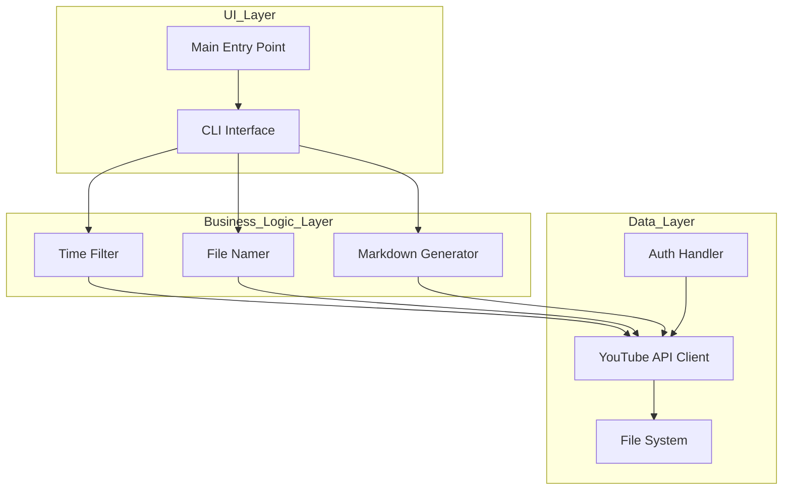
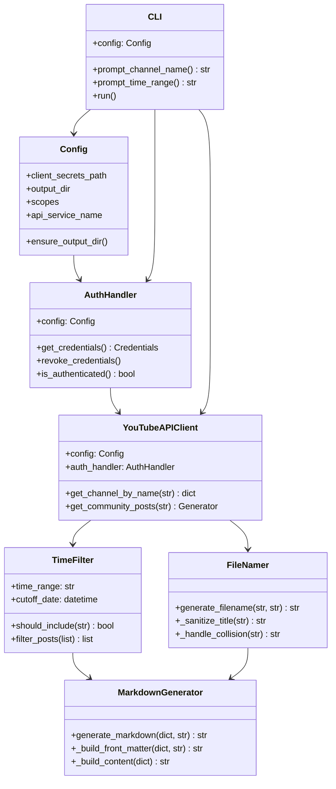
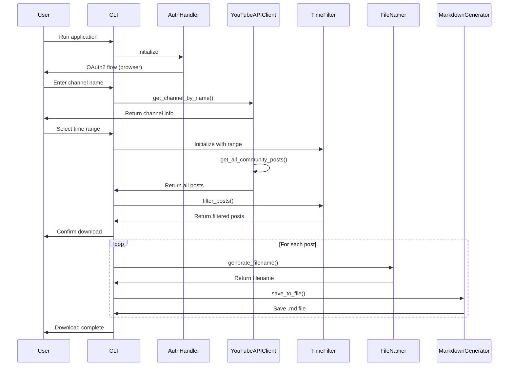
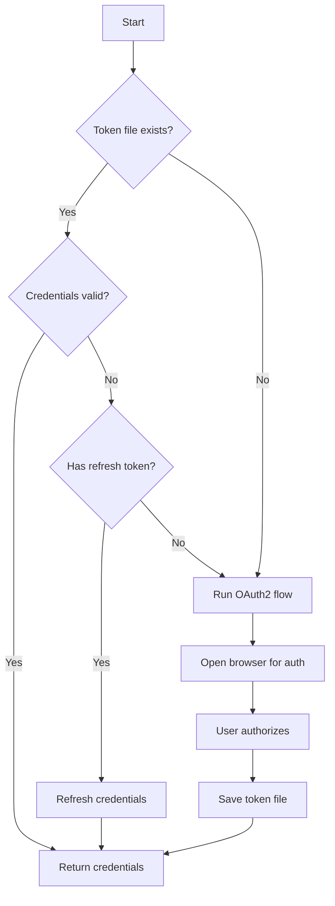
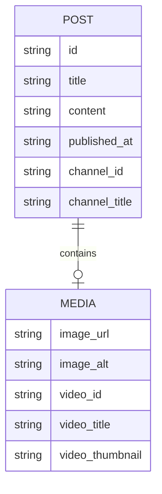
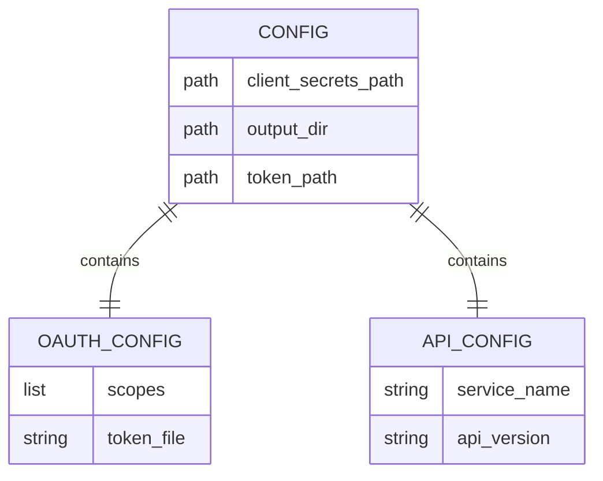
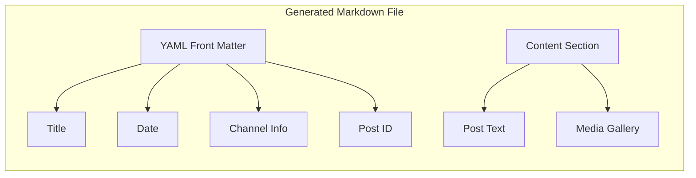
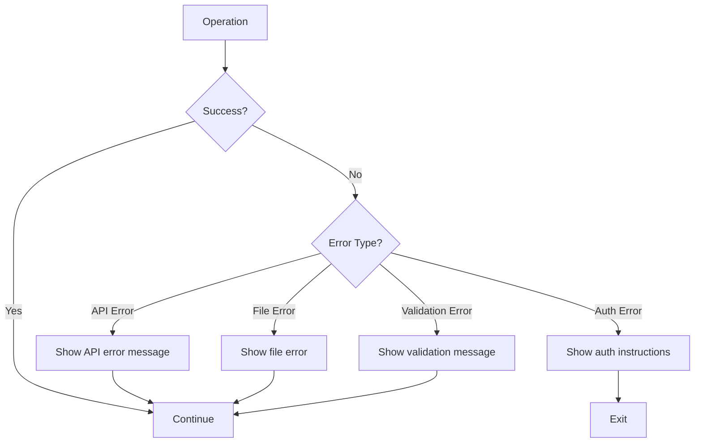

# YouTube Posts Downloader - Design Document

## Overview

This document describes the architecture and design of the YouTube Posts Downloader, a CLI utility that downloads YouTube Community Posts from subscribed channels as individual Markdown files.

## Architecture

### High-Level Architecture



### Module Structure



## User Flow

### Main CLI Flow



### Authentication Flow



## Data Models

### Post Data Structure



### Configuration Settings



## File Output Format

### Markdown File Structure



Example output:

```markdown
---
title: Post Title
date: 2023-06-15 10:30:00
channel_id: UC123
channel_title: Test Channel
post_id: post123
filename: 2023-06-15_post-title.md
image_url: https://example.com/image.jpg
video_id: abc123
video_title: My Video
---

Post content here...


### My Video

[Watch on YouTube](https://www.youtube.com/watch?v=abc123)
```

## Error Handling



## Time Range Options

| Option | Days | Description |
|--------|------|-------------|
| inception | None | All posts from channel creation |
| 5 years | 1825 | Posts from last 5 years |
| 3 years | 1095 | Posts from last 3 years |
| 1 year | 365 | Posts from last year |
| 6 months | 180 | Posts from last 6 months |
| 1 month | 30 | Posts from last month |
| daily | 1 | Posts from today only |

## Dependencies

```
google-api-python-client>=2.100.0
google-auth-oauthlib>=1.0.0
google-auth-httplib2>=0.1.0
oauth2client>=4.1.3
python-dateutil>=2.8.2
pyyaml>=6.0
pytest>=7.0.0
pytest-cov>=4.0.0
pytest-mock>=3.10.0
python-dotenv>=1.0.0
```

## Configuration Files

### OAuth2 Client Secrets (client_secrets.json)

```json
{
  "web": {
    "client_id": "YOUR_CLIENT_ID",
    "project_id": "YOUR_PROJECT_ID",
    "auth_uri": "https://accounts.google.com/o/oauth2/auth",
    "token_uri": "https://oauth2.googleapis.com/token",
    "auth_provider_x509_cert_url": "https://www.googleapis.com/oauth2/v1/certs",
    "client_secret": "YOUR_CLIENT_SECRET",
    "redirect_uris": ["http://localhost:8080"]
  }
}
```

## Security Considerations

1. **OAuth2 Tokens**: Stored in `token.json` with user read/write permissions only
2. **Client Secrets**: Never committed to version control
3. **API Keys**: Used via OAuth2, no exposed API keys
4. **File Permissions**: Output files created with standard umask

## Future Enhancements

- [ ] Download images locally and update paths
- [ ] Support for video post downloads
- [ ] Batch download multiple channels
- [ ] Export to other formats (PDF, HTML)
- [ ] Progress bar for large downloads
- [ ] Resume interrupted downloads